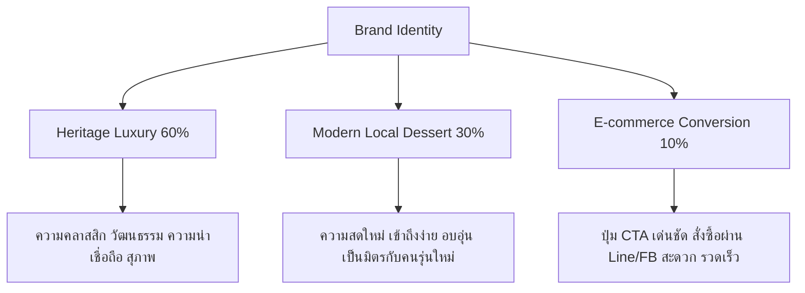
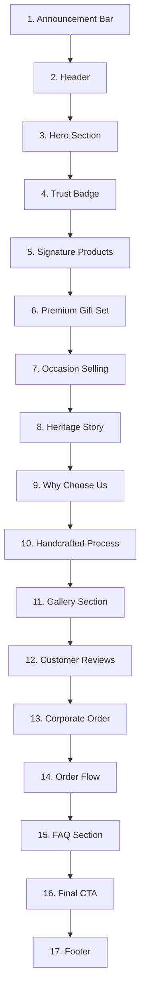
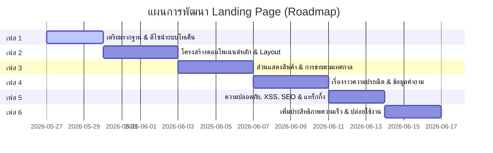

# แผนการพัฒนา Landing Page: ข้าวเม่าพรีเมียม (Premium Khao Mao)
> **แนวคิดหลัก:** Heritage Luxury + Modern Local Dessert  
> **กลุ่มเป้าหมาย:** ลูกค้าทั่วไป, ผู้ซื้อของฝาก, ลูกค้าองค์กร (B2B), นักท่องเที่ยว

---

## สารบัญ (Table of Contents)
1. [เป้าหมายและวิสัยทัศน์ของโครงการ (Objective & Vision)](#1-เป้าหมายและวิสัยทัศน์ของโครงการ-objective--vision)
2. [ทิศทางแบรนด์ (Brand Direction)](#2-ทิศทางแบรนด์-brand-direction)
3. [กลุ่มลูกค้าเป้าหมาย (Target Customers)](#3-กลุ่มลูกค้าเป้าหมาย-target-customers)
4. [แนวทางด้านภาพและอัตลักษณ์ (Visual Direction)](#4-แนวทางด้านภาพและอัตลักษณ์-visual-direction)
5. [เทคโนโลยีและมาตรฐานที่เลือกใช้ (Technology Stack & Architecture)](#5-เทคโนโลยีและมาตรฐานที่เลือกใช้-technology-stack--architecture)
6. [โครงสร้างหน้า Landing Page (Page Structure & Component Specs)](#6-โครงสร้างหน้า-landing-page-page-structure--component-specs)
7. [สถาปัตยกรรมคอมโพเนนต์และการจัดการข้อมูล (Component Architecture & Data)](#7-สถาปัตยกรรมคอมโพเนนต์และการจัดการข้อมูล-component-architecture--data)
8. [ข้อกำหนดการรองรับการแสดงผลบนมือถือ (Mobile Responsive & UX Specs)](#8-ข้อกำหนดการรองรับการแสดงผลบนมือถือ-mobile-responsive--ux-specs)
9. [ข้อกำหนดด้านความปลอดภัยและการป้องกัน XSS (Security & XSS Protection)](#9-ข้อกำหนดด้านความปลอดภัยและการป้องกัน-xss-security--xss-protection)
10. [ข้อกำหนดด้าน SEO และโครงสร้างข้อมูล (SEO & Structured Data)](#10-ข้อกำหนดด้าน-seo-และโครงสร้างข้อมูล-seo--structured-data)
11. [ข้อกำหนดด้านการรองรับผู้พิการ (Accessibility - a11y)](#11-ข้อกำหนดด้านการรองรับผู้พิการ-accessibility---a11y)
12. [การวัดผลและการจัดเก็บข้อมูลเหตุการณ์ (Analytics & Tracking)](#12-การวัดผลและการจัดเก็บข้อมูลเหตุการณ์-analytics--tracking)
13. [การแบ่งเฟสการดำเนินงาน (Implementation Phases & Roadmap)](#13-การแบ่งเฟสการดำเนินงาน-implementation-phases--roadmap)
14. [รายการตรวจสอบคุณภาพขั้นสุดท้าย (Final Quality Checklist)](#14-รายการตรวจสอบคุณภาพขั้นสุดท้าย-final-quality-checklist)

---

## 1. เป้าหมายและวิสัยทัศน์ของโครงการ (Objective & Vision)

สร้าง **Premium Khao Mao Landing Page** ที่ไม่เพียงแต่เป็นหน้าเว็บขายสินค้า แต่เป็น **Digital Brand Experience** ที่ช่วยยกระดับ "ข้าวเม่า" ขนมไทยพื้นถิ่นดั้งเดิมให้กลายเป็นแบรนด์ระดับพรีเมียม (Premiumization) สื่อสารความพิถีพิถันในการคัดสรรวัตถุดิบและกระบวนการทำสดใหม่ พร้อมกระตุ้นการสั่งซื้อผ่านช่องทางออนไลน์ยอดนิยม (LINE / Facebook / โทรศัพท์) ได้อย่างมีประสิทธิภาพสูงสุด

---

## 2. ทิศทางแบรนด์ (Brand Direction)

แบรนด์จะใช้แนวทางการออกแบบ **Heritage Luxury (60%) + Modern Local Dessert (30%) + E-commerce Conversion (10%)**



*   **Brand Concept:** ข้าวเม่าไทยแท้ จากรสชาติพื้นถิ่น สู่ของฝากพรีเมียมร่วมสมัย
*   **Brand Message:** คัดสรรวัตถุดิบคุณภาพ ทำสดใหม่อย่างพิถีพิถัน เพื่อส่งต่อรสชาติขนมไทยดั้งเดิมในรูปแบบของฝากที่มีคุณค่า
*   **Mood & Feel:** Premium, Warm, Natural, Thai Contemporary, Clean, Handcrafted, Trustworthy, Local Heritage, Giftable

---

## 3. กลุ่มลูกค้าเป้าหมาย (Target Customers)

1.  **ลูกค้าทั่วไปที่ชื่นชอบขนมไทยโบราณ:**
    *   *ความต้องการหลัก:* รสชาติดั้งเดิม สดใหม่ สะอาด อร่อย ไม่หวานตัดขา สั่งซื้อง่ายผ่าน Social Media
2.  **ลูกค้าที่กำลังมองหาของฝากพรีเมียม:**
    *   *ความต้องการหลัก:* บรรจุภัณฑ์สวยงามดูแพง (Premium Packaging) มอบให้ผู้ใหญ่แล้วดูมีคุณค่าและให้เกียรติผู้รับ สื่อถึงความใส่ใจ
3.  **ลูกค้ากลุ่มองค์กรและธุรกิจ (B2B):**
    *   *ความต้องการหลัก:* สั่งซื้อจำนวนมากสำหรับงานสัมมนา ต้อนรับคู่ค้า หรือเทศกาลต่างๆ ร้านต้องมีความน่าเชื่อถือสูง สามารถออกเอกสารได้ และติดต่อสื่อสารได้สะดวกรวดเร็ว
4.  **นักท่องเที่ยวและลูกค้าต่างจังหวัด:**
    *   *ความต้องการหลัก:* ของฝากที่เป็นเอกลักษณ์เฉพาะถิ่น มีข้อมูลอายุการเก็บรักษาและการจัดส่งที่ชัดเจน บรรจุภัณฑ์สุญญากาศที่รักษาคุณภาพได้ดีระหว่างเดินทาง

---

## 4. แนวทางด้านภาพและอัตลักษณ์ (Visual Direction)

### 4.1 จานสีประจำแบรนด์ (Brand Color Palette)

แบรนด์ใช้โทนสีธรรมชาติที่สะท้อนถึงรวงข้าว มะพร้าวอ่อน และใบตอง ผสานกับสีทองหรูหรา

| Color Name | Hex Code | Usage Scenario / Purpose | Tailwind Configuration Name |
| :--- | :--- | :--- | :--- |
| **Warm Cream** | `#F8F1E6` | สีพื้นหลังหลักของเว็บไซต์ ให้ความรู้สึกอบอุ่น สบายตา สะอาด | `bg-cream` |
| **Ivory White** | `#FFFDF8` | สีพื้นหลังการ์ดหรือเซกชันย่อย ช่วยยกเนื้อหาให้ลอยและเด่นขึ้น | `bg-ivory` |
| **Deep Leaf Green**| `#214D38` | สีหลักประจำแบรนด์ (Primary) ใช้สำหรับปุ่ม CTA, หัวข้อสำคัญ, และเน้นแบรนด์ | `bg-leaf` / `text-leaf` |
| **Young Rice Green**| `#7C9A62` | สีรอง (Secondary) ใช้สำหรับ Badge, ไอคอนประกอบ, หรือเน้นประโยคเด่น | `bg-riceGreen` / `text-riceGreen` |
| **Soft Gold** | `#C9A45C` | สีเน้นความพรีเมียม (Premium Accent) สำหรับขอบการ์ดพิเศษ, Badge บ่งบอกคุณค่า | `bg-gold` / `text-gold` / `border-gold` |
| **Rice Brown** | `#8B6A45` | สีสำหรับคำอธิบายย่อย (Subtitle), ข้อความที่สอง, เพื่อความนุ่มนวลกว่าสีดำ | `text-riceBrown` |
| **Charcoal** | `#2B2B2B` | สีตัวอักษรเนื้อหาหลัก (Body text) ให้อ่านง่ายแต่ไม่แข็งกระด้างเหมือนสีดำสนิท| `text-charcoal` |
| **Muted Beige** | `#E7D8C2` | สีสำหรับเส้นคั่น (Divider), เส้นขอบการ์ดทั่วไป (Border) ให้ดูกลืนกับสีครีม | `border-beige` / `bg-beige` |

### 4.2 ระบบอักษร (Typography & Hierarchy)

เพื่อสะท้อนความพรีเมียมดั้งเดิมร่วมกับความทันสมัย แนะนำ Font Pairing 2 ตัวเลือกหลัก:

*   **ตัวเลือกแนะนำ (Option A):**
    *   **Heading:** *Noto Serif Thai* (ฟอนต์มีหัวแบบดั้งเดิม ให้ความรู้สึกภูมิฐาน หรูหรา มีประวัติศาสตร์)
    *   **Body:** *Noto Sans Thai* (ฟอนต์ไม่มีหัวที่อ่านง่ายมากบนมือถือ ลื่นตา สวยงามร่วมสมัย)
*   **ตัวเลือกสำรอง (Option B):**
    *   **Heading:** *IBM Plex Sans Thai* (SemiBold) ให้ความร่วมสมัย เป็นมิตร สากล
    *   **Body:** *IBM Plex Sans Thai* (Regular) สะอาดตา จัดเรียงได้เป็นระเบียบ
*   **ข้อกำหนดทางเทคนิค:**
    *   ขนาดฟอนต์ของเนื้อหา (Body) บนสมาร์ตโฟนต้องไม่ต่ำกว่า `16px` (`text-base`) เพื่อให้อ่านง่ายโดยไม่ต้องซูม
    *   ใช้น้ำหนักอักษร (Font Weight) ที่พอดี หลีกเลี่ยงฟอนต์ที่บางเกินไปเพราะจะกลืนไปกับพื้นหลังสีครีมยามแสงจ้า

### 4.3 สไตล์รูปภาพและองค์ประกอบศิลป์ (Image Style Guide)

*   **แสงและโทนสี:** ใช้ภาพถ่ายแสงธรรมชาติ (Natural light) โทนอุ่น (Warm-toned) หลีกเลี่ยงแสงแฟลชแข็งหรือสตูดิโอที่ดูประดิษฐ์เกินไป
*   **ระยะและมุมกล้อง:** ผสมผสานระหว่างรูป Close-up ที่เห็นเนื้อสัมผัสของข้าวเม่า เม็ดข้าวสีเขียว มะพร้าวขูดเส้นนุ่ม และรูปภาพกระบวนการทำที่แสดงฝีมือและการหยิบจับ (Handcrafted)
*   **ฉากหลังและอุปกรณ์ประกอบ:** ใช้ฉากหลังไม้ ภาชนะศิลาดล จานเซรามิกทำมือ ใบตองสด หรือผ้าทอดั้งเดิม เพื่อขับเน้นภาพลักษณ์ความพรีเมียม
*   **รูปภาพไลฟ์สไตล์:** ภาพการจัดเสิร์ฟข้าวเม่าคู่กับชาร้อนหรือกาแฟยามบ่าย เพื่อเพิ่มมูลค่าการใช้งานและสร้างภาพในฝันของลูกค้า

---

## 5. เทคโนโลยีและมาตรฐานที่เลือกใช้ (Technology Stack & Architecture)

*   **Frontend Framework:** Angular (เวอร์ชันล่าสุด) เพื่อประสิทธิภาพที่เสถียร มีระบบ Component สถาปัตยกรรมที่ดี และความปลอดภัยในตัวสูง
*   **CSS Framework:** Tailwind CSS (Utility-first) สำหรับพัฒนาหน้าจอ Responsive ได้รวดเร็ว คุม Spacing และโทนสีได้มีระบบผ่านไฟล์ Config
*   **Styling Convention:**
    *   ใช้ CSS Variables ผสมกับ Tailwind Custom Colors ในไฟล์ `tailwind.config.js` เพื่อความเป็นหนึ่งเดียว
    *   จัด Spacing บนหลักการคูณ 4 (เช่น `p-4`, `py-8`, `my-16`) เพื่อความสม่ำเสมอของจังหวะสายตา
    *   โครงสร้างคลาสต้องไม่ซ้ำซากจำเจ หากคลาสเริ่มยาวใน HTML ให้จัดกลุ่มหรือสร้าง Component ย่อย

ตัวอย่างการตั้งค่า `tailwind.config.js`:
```javascript
module.exports = {
  theme: {
    extend: {
      colors: {
        cream: '#F8F1E6',
        ivory: '#FFFDF8',
        leaf: '#214D38',
        riceGreen: '#7C9A62',
        gold: '#C9A45C',
        riceBrown: '#8B6A45',
        charcoal: '#2B2B2B',
        beige: '#E7D8C2',
      },
      fontFamily: {
        serifThai: ['"Noto Serif Thai"', 'serif'],
        sansThai: ['"Noto Sans Thai"', 'sans-serif'],
      }
    },
  },
}
```

---

## 6. โครงสร้างหน้า Landing Page (Page Structure & Component Specs)

หน้านี้จะวางโครงสร้างทั้งหมด 17 ส่วนตามหลักจิตวิทยาการขาย (AIDA Model) เพื่อดึงดูดความสนใจ สร้างความอยากได้ ให้เหตุผลสนับสนุนความน่าเชื่อถือ และปิดการขายได้อย่างเป็นขั้นตอน



### 1. Announcement Bar
*   **จุดประสงค์:** แจ้งโปรโมชันส่งเสริมการขายล่าสุด หรือแจ้งเวลาตัดรอบส่งของเพื่อสร้างความเร่งรีบ (Urgency)
*   **Layout:** แถบสีเขียวเข้มคาดด้านบนสุด ความสูงประมาณ `36px` - `40px` ตัวอักษรสีครีมวิ่งขยับเบาๆ หรือสลับข้อความ
*   **Content:** "✨ โปรโมชันเปิดตัวแบรนด์: สั่งซื้อชุด Premium Gift Set วันนี้ รับส่วนลดพิเศษทันที หรือส่งฟรีทั่วไทยเมื่อสั่งครบ 1,200 บาท"
*   **Component:** `announcement-bar.component.ts`

### 2. Header / Navigation
*   **จุดประสงค์:** นำทางผู้ใช้ไปยังเซกชันหลักๆ และแสดงตราสัญลักษณ์แบรนด์เพื่อสร้างความคุ้นเคย
*   **Layout:** โครงสร้างกึ่งโปร่งใส (Glassmorphism) สีไอวอรีเบลอหลัง (`bg-ivory/80 backdrop-blur-md`) เมื่อเลื่อนลงมาให้เปลี่ยนเป็น Sticky Header
*   **Content:**
    *   ด้านซ้าย: ตราสัญลักษณ์แบรนด์ ข้าวเม่าพรีเมียม
    *   ตรงกลาง: เมนูหลัก (เมนูแนะนำ, ชุดของขวัญ, เรื่องราวของเรา, วิธีการสั่งซื้อ, คำถามที่พบบ่อย)
    *   ด้านขวา: ปุ่มสั่งซื้อทันที (ทัก LINE สีเขียว)
*   **Component:** `landing-header.component.ts`

### 3. Hero Section (ส่วนแรกต้อนรับ)
*   **จุดประสงค์:** ดึงดูดสายตาและทำความเข้าใจภายใน 5 วินาทีว่าร้านขายอะไร จุดเด่นคืออะไร และสั่งอย่างไร
*   **Layout:**
    *   *Desktop:* แบ่งเป็น 2 คอลัมน์ ด้านซ้ายข้อความพาดหัวสะดุดตา ปุ่ม CTA ขนาดใหญ่ ด้านขวาเป็นรูปภาพข้าวเม่าคัดสรรแบบ High Definition บนภาชนะหรูหรา
    *   *Mobile:* คอลัมน์เดียว เรียงจากหัวข้อหลัก -> หัวข้อย่อย -> ปุ่ม CTA หลัก -> รูปภาพ Hero (จัดลำดับให้อยู่ในตรรกะแรกเพื่อตอบโจทย์เหนือระดับพับจอ - Above the fold)
*   **Content:**
    *   **Headline:** "ข้าวเม่าไทยแท้ ของฝากพรีเมียมร่วมสมัย"
    *   **Subheadline:** "คัดสรรวัตถุดิบคุณภาพสูงจากไร่ชุมชน ทำสดใหม่อย่างพิถีพิถัน เหมาะสำหรับทานเองยามบ่าย มอบเป็นของฝากทรงคุณค่า หรือสั่งชุดของขวัญองค์กรในวาระพิเศษ"
    *   **Primary CTA:** "สั่งซื้อผ่าน LINE" (ไอคอน LINE)
    *   **Secondary CTA:** "ดูชุดของฝากพรีเมียม" (ไอคอนลูกศรชี้ลง)
*   **Component:** `hero-section.component.ts`
*   **หมายเหตุ:** รูปภาพหลักในหน้านี้ห้ามทำ Lazy Loading และต้องเซ็ต LCP ให้เร็วที่สุด

### 4. Trust Badge Section (แถบยืนยันความน่าเชื่อถือ)
*   **จุดประสงค์:** ลดความตระหนักกังวลของลูกค้าด้วยสัญลักษณ์รับประกันคุณภาพ
*   **Layout:** แถบไอคอนแนวราบแบบมินิมอล มีพื้นหลังสีครีมอ่อนๆ จัดระยะห่างสม่ำเสมอ
*   **Content:**
    *   [Icon: Fresh] "ทำสดใหม่วันต่อวัน"
    *   [Icon: Award] "ข้าวเหนียวพันธุ์ดีคัดมือ"
    *   [Icon: Clean] "สะอาด ปลอดสารเคมี 100%"
    *   [Icon: Shield] "บรรจุระบบสุญญากาศถนอมรส"
*   **Component:** `trust-badge-list.component.ts`

### 5. Signature Products Section (รายการเมนูหลักของร้าน)
*   **จุดประสงค์:** แสดงรายการสินค้าหลักเพื่อกระตุ้นความน่ากินและความสนใจซื้อ
*   **Layout:** Grid Layout 3 คอลัมน์ (Desktop) และ 1 คอลัมน์เต็มความกว้าง (Mobile) การ์ดใช้โทนสี Ivory ขอบครีม
*   **Content:** แสดงการ์ดรายการเมนูซิกเนเจอร์ (ข้าวเม่าคลุกมะพร้าวอ่อน, ข้าวเม่าทอดดั้งเดิม, ข้าวเม่ารางหอมกรุ่น, ข้าวเม่าอบกรอบ) มีรายละเอียดสั้น ราคา และปุ่มสั่งเฉพาะเมนู
*   **Component:** `signature-product-section.component.ts` ร่วมกับ `product-card.component.ts`

### 6. Premium Gift Set Section (กล่องของฝากยกระดับภาพลักษณ์)
*   **จุดประสงค์:** เน้นการสร้างรายได้เพิ่มต่อออเดอร์ (AOV - Average Order Value) โดยเจาะกลุ่มซื้อเป็นของฝาก
*   **Layout:** รูปแบบการสลับข้างซ้าย-ขวาระหว่างภาพถ่ายกล่องของขวัญขนาดใหญ่กับเนื้อหาประโยคขายพรีเมียม
*   **Content:** แสดงภาพแพ็กเกจจิ้งกล่องไม้พรีเมียม โบว์ริบบิ้น และเครื่องเคียงประกอบชุดของขวัญ พร้อมปุ่ม CTA "ดูรายละเอียดชุดของฝาก"
*   **Component:** `gift-set-highlight.component.ts`

### 7. Occasion-Based Selling Section (ขายสินค้าตามโอกาสพิเศษ)
*   **จุดประสงค์:** ช่วยลูกค้าตัดสินใจโดยใช้โอกาสเป็นตัวนำทาง (เช่น เทศกาลปีใหม่, งานทำบุญบ้าน)
*   **Layout:** แสดงเป็นภาพการ์ดขนาดใหญ่ 3-4 บล็อก มีโอเวอร์เลย์สีดำจางๆ และข้อความบอกโอกาสอยู่บนรูป
*   **Content:** "ซื้อฝากผู้ใหญ่ที่เคารพ", "ของขวัญต้อนรับคู่ค้าธุรกิจ", "ทานคู่น้ำชาถ้วยโปรด", "ของต้อนรับแขกในงานบุญดั้งเดิม"
*   **Component:** `occasion-section.component.ts`

### 8. Heritage Story Section (ประวัติความเป็นมาและเรื่องราวแบรนด์)
*   **จุดประสงค์:** สร้างความผูกพันและคุณค่าของแบรนด์ผ่านเรื่องราว (Brand Storytelling) ให้ลูกค้ารู้สึกมีส่วนร่วมในการอนุรักษ์รสชาติท้องถิ่น
*   **Layout:** โทนอบอุ่น มีภาพพื้นหลังลายไทยร่วมสมัยแบบบางเบา ผสานภาพถ่ายขาวดำหรือสีเซเปียของชาวบ้านคัดสรรรวงข้าว
*   **Content:** เล่าเรื่องราวจากทุ่งนาเกษตรกรท้องถิ่นสู่กรรมวิธีการตำแบบโบราณที่นำมารื้อฟื้นในรูปแบบความพรีเมียมสะอาดสะอ้าน
*   **Component:** `heritage-story-section.component.ts`

### 9. Why Choose Us Section (ทำไมต้องเลือกข้าวเม่าของร้านเรา)
*   **จุดประสงค์:** นำเสนอจุดเปรียบเทียบเด่น (Unique Selling Points) ที่ต่างจากข้าวเม่าริมทางทั่วไป
*   **Layout:** ไอคอน 4 ด้านจัดสัดส่วนเรียบง่าย พร้อมคำอธิบายย่อที่แสดงความเอาใจใส่
*   **Content:** ความแตกต่างด้านสุขอนามัย, บรรจุภัณฑ์สุญญากาศกันชื้นกันลม, ความอ่อนเยาว์ของเม็ดข้าวที่คัดเก็บเกี่ยวในเวลาที่เฉพาะเจาะจง
*   **Component:** `why-choose-us-section.component.ts`

### 10. Handcrafted Process Section (ขั้นตอนการรังสรรค์แบบทำมือ)
*   **จุดประสงค์:** เน้นย้ำภาพลักษณ์ความใส่ใจและประณีต (Handcrafted) ด้วยขั้นตอนชัดเจน
*   **Layout:** เส้นขั้นตอนแนวราบ (Desktop) หรือแนวตั้ง (Mobile) ประกอบด้วยตัวเลขและคำอธิบายสั้นๆ
*   **Content:** 1. คัดสรรรวงข้าวอ่อนเปลือกบาง -> 2. คั่วเตาดินฟืนธรรมชาติ -> 3. ตำซ้อมมือสูตรดั้งเดิม -> 4. คลุกเคล้าส่วนผสมมะพร้าวสดสดใหม่ -> 5. บรรจุสุญญากาศควบคุมความชื้น
*   **Component:** `handcrafted-process-section.component.ts`

### 11. Product Gallery Section (ภาพถ่ายมุมมองไลฟ์สไตล์)
*   **จุดประสงค์:** สร้างแรงบันดาลใจด้วยภาพถ่ายมุมสวยงาม น่ากิน น่าแชร์
*   **Layout:** แกลเลอรีรูปแบบ Responsive Grid โฟกัสความงามของเนื้อสัมผัสแบบซูมลึก
*   **Content:** ภาพถ่ายคู่กับชุดชาโบราณ ภาพแกะกล่องเปิดฝา ภาพการตักป้อน ภาพบรรยากาศรื่นรมย์
*   **Component:** `gallery-section.component.ts`
*   **หมายเหตุ:** ใช้ระบบ Lazy Loading รูปภาพเต็มรูปแบบ พร้อมกำหนดอัตราส่วนภาพป้องกันเลย์เอาต์เลื่อนไถล (CLS)

### 12. Customer Review Section (เสียงยืนยันความพึงพอใจจากลูกค้าจริง)
*   **จุดประสงค์:** ความน่าเชื่อถือทางสังคม (Social Proof) ที่ช่วยกระตุ้นการตัดสินใจของผู้ใช้ใหม่
*   **Layout:** การ์ดรีวิวแสดงในรูปแบบ Carousel ปัดง่ายบนมือถือ พร้อมดาวคะแนน 5 ดาวเด่นชัด
*   **Content:** คำชื่นชมจากลูกค้าจริง กลุ่มซื้อไปเป็นของขวัญปีใหม่ กลุ่มจัดเลี้ยงบริษัท และลูกค้าที่ทานคู่กับชา
*   **Component:** `review-section.component.ts`

### 13. Corporate Order Section (บริการเพื่อลูกค้าองค์กร)
*   **จุดประสงค์:** เจาะกลุ่มเป้าหมายปริมาณเยอะ (B2B Leads) ด้วยเนื้อหาเฉพาะและการสื่อสาร
*   **Layout:** การ์ดหรูสีเขียวเข้มขอบทองคำ เพื่อสื่ออารมณ์ความจริงจัง น่าเชื่อถือทางธุรกิจ
*   **Content:** รายละเอียดรับทำชุดกล่องของขวัญโลโก้องค์กร บริการปรับแต่งสีโบว์ การจัดส่งแยกรายที่อยู่ และปุ่ม CTA "ขอใบเสนอราคาด่วน"
*   **Component:** `corporate-order-section.component.ts`

### 14. Order Flow Section (ขั้นตอนการสั่งซื้อที่เข้าใจง่าย)
*   **จุดประสงค์:** ขจัดความสับสนในการซื้อขายผ่าน Social Commerce
*   **Layout:** ขั้นตอนลำดับเลขพร้อมไอคอนที่คุ้นตาของ LINE และระบบขนส่งสินค้า
*   **Content:** 1. ทักแชท LINE เพื่อเลือกสินค้า -> 2. ชำระเงินปลายทางหรือโอนบัญชี -> 3. รับเลขออเดอร์ยืนยันส่งตรงจากร้าน -> 4. รอรับขนส่งแช่เย็นควบคุมอุณหภูมิทั่วประเทศ
*   **Component:** `order-flow-section.component.ts`

### 15. FAQ Section (คำถามที่พบบ่อย)
*   **จุดประสงค์:** ลดงานแอดมินตอบแชทด้วยการเคลียร์ข้อสงสัยหลักก่อนลูกค้าทักแชท
*   **Layout:** Accordion Layout บีบเนื้อหากระชับ มีการสลับการเปิด-ปิดราบรื่น มีมาตรฐานความเข้าถึงสำหรับทุกคน (a11y)
*   **Content:** ตอบข้อสงสัย 10 ข้อหลัก (วันหมดอายุ, สั่งล่วงหน้ากี่วัน, จัดส่งอย่างไร, การเก็บรักษา, ชุดองค์กร ฯลฯ)
*   **Component:** `faq-section.component.ts`

### 16. Final CTA Section (ส่วนปิดท้ายเพื่อการสั่งซื้อ)
*   **จุดประสงค์:** กระตุ้นเตือนการดำเนินการสั่งซื้ออีกครั้งเมื่อผู้ใช้อ่านเนื้อหาจนจบหน้าเว็บ
*   **Layout:** แบนเนอร์ภาพเด่นเต็มแผ่นสีเขียวเข้ม ตัวอักษรสีครีมทองหรูหรา และปุ่ม LINE คอนทราสต์สะดุดสายตา
*   **Content:** "ลิ้มรสชาติข้าวเม่าพรีเมียม ส่งต่อความอร่อยและความใส่ใจในทุกคำ สั่งซื้อเลยวันนี้ผ่านทาง LINE เพื่อรับสิทธิ์ส่งฟรีด่วนพิเศษ!"
*   **Component:** `final-cta-section.component.ts`

### 17. Footer (ส่วนท้ายเว็บ)
*   **จุดประสงค์:** แสดงความถูกต้องตามกฎหมาย ข้อมูลการติดต่อ โซเชียลมีเดีย และที่ตั้งหน้าร้าน
*   **Layout:** จัดวางแบบ 3-4 คอลัมน์บน Desktop ย่อตัวลงเป็น 1 คอลัมน์บนมือถือ พื้นหลังสีถ่านเข้ม (`bg-charcoal`)
*   **Content:** ข้อมูลติดต่อร้าน ลิงก์นโยบายข้อมูลส่วนบุคคล (PDPA) โลโก้รับรอง แผนที่ Google Map ลิงก์ติดต่อโซเชียลมีเดีย
*   **Component:** `landing-footer.component.ts`

---

## 7. สถาปัตยกรรมคอมโพเนนต์และการจัดการข้อมูล (Component Architecture & Data)

แนะนำโครงสร้างโฟลเดอร์ใน Angular เพื่อความเป็นระเบียบและดูแลรักษาง่ายในอนาคต:

```text
src/app/landing-page/
├── landing-page.component.html
├── landing-page.component.ts
├── landing-page.component.scss
├── components/
│   ├── announcement-bar/
│   │   ├── announcement-bar.component.ts
│   │   └── announcement-bar.component.html
│   ├── landing-header/
│   │   ├── landing-header.component.ts
│   │   └── landing-header.component.html
│   ├── hero-section/
│   │   ├── hero-section.component.ts
│   │   └── hero-section.component.html
│   ├── trust-badge-list/
│   ├── signature-product-section/
│   ├── product-card/
│   ├── gift-set-highlight/
│   ├── occasion-section/
│   ├── heritage-story-section/
│   ├── why-choose-us-section/
│   ├── handcrafted-process-section/
│   ├── gallery-section/
│   ├── review-section/
│   ├── corporate-order-section/
│   ├── order-flow-section/
│   ├── faq-section/
│   ├── final-cta-section/
│   └── landing-footer/
└── data/
    ├── product.mock.ts
    ├── review.mock.ts
    └── faq.mock.ts
```

### 7.1 ตัวอย่างข้อมูลจำลองสินค้า (Mock Product Data)

ข้อมูลสินค้าจำลองจะถูกเก็บไว้ที่ `src/app/landing-page/data/product.mock.ts` เพื่อตัดการติดต่อ API ในระยะเริ่มต้นและสนับสนุนการแก้ไขภายหลังได้สะดวก

#### ข้อมูลจำลองในรูปแบบตาราง (Table View)

| id | productName | category | premiumBadge | priceText | shortDescription | ctaText |
| :--- | :--- | :--- | :--- | :--- | :--- | :--- |
| `khao-mao-kluk` | ข้าวเม่าคลุกมะพร้าวอ่อนน้ำหอม | Signature Menu | Signature | สอบถามราคาพิเศษ | ข้าวเม่าตำมือหอมละมุน คลุกมะพร้าวน้ำหอมสดเส้นบาง รสชาติไทยแท้ดั้งเดิม | สั่งซื้อเมนูนี้ |
| `khao-mao-tod` | ข้าวเม่าทอดสูตรชาววังดั้งเดิม | Signature Menu | Best Seller | สอบถามราคาพิเศษ | กล้วยไข่สุกพอดี ห่อหุ้มข้าวเม่าทอดกรอบฟู ไม่อมน้ำมัน ไม่อ้วนง่าย | สั่งซื้อเมนูนี้ |
| `khao-mao-rang` | ข้าวเม่ารางหอมกรุ่นโบราณ | Signature Menu | Traditional | สอบถามราคาพิเศษ | ข้าวเม่าคั่วโบราณอบควันเทียนหอม ดั่งขนมในวังหลวงโบราณ รสสัมผัสกรุบกรอบ | สั่งซื้อเมนูนี้ |
| `crispy-khao-mao` | ข้าวเม่าอบกรอบปรุงรสพิเศษ | Snack | New | สอบถามราคาพิเศษ | ข้าวเม่าผ่านระบบแปรรูปอบกรอบไร้น้ำมัน เพื่อสุขภาพ รสหวานนวลกลมกล่อม | สั่งซื้อเมนูนี้ |
| `premium-gift-set` | Premium Wooden Gift Set | Gift Set | Premium Gift | สอบถามราคาพิเศษ | เซ็ตของขวัญกล่องไม้สักดีไซน์สวย บรรจุข้าวเม่าพรีเมียมหลากรส ชาออร์แกนิก | ดูชุดของฝาก |
| `corporate-gift-box`| Corporate Premium Gift Box | Corporate | Corporate Order | สอบถามราคาพิเศษ | บริการออกแบบลายกล่องและการ์ดอวยพรตราแบรนด์คุณ เหมาะเป็นของสมนาคุณ | สอบถามแพ็กเกจ |

#### ข้อมูลจำลองในรูปแบบ TypeScript / JSON

```typescript
export interface Product {
  id: string;
  productName: string;
  category: string;
  premiumBadge?: string;
  shortDescription: string;
  priceText: string;
  imageSuggestion: string;
  ctaText: string;
}

export const MOCK_PRODUCTS: Product[] = [
  {
    "id": "khao-mao-kluk",
    "productName": "ข้าวเม่าคลุกมะพร้าวอ่อนน้ำหอม",
    "category": "Signature Menu",
    "premiumBadge": "Signature",
    "shortDescription": "ข้าวเม่าหอมละมุน คลุกมะพร้าวอ่อนสดใหม่ รสชาติไทยแท้ที่คุ้นเคย หวานน้อยกลมกล่อม",
    "priceText": "เริ่มต้น 120.- / กล่อง",
    "imageSuggestion": "ภาพ Close-up ข้าวเม่าคลุกสีเขียวอ่อนในจานดินเผาเคียงข้างเนื้อมะพร้าวอ่อน",
    "ctaText": "สั่งซื้อเมนูนี้"
  },
  {
    "id": "khao-mao-tod",
    "productName": "ข้าวเม่าทอดสูตรชาววังดั้งเดิม",
    "category": "Signature Menu",
    "premiumBadge": "Best Seller",
    "shortDescription": "กล้วยไข่คัดหวานพอดี หุ้มแป้งข้าวเม่ากรอบสีเขียวตองทองอร่าม ทอดใหม่ไม่อมน้ำมัน",
    "priceText": "เริ่มต้น 150.- / ชุด",
    "imageSuggestion": "ภาพข้าวเม่าทอดผ่าครึ่งแสดงกล้วยไข่สีเหลืองนวลด้านใน แป้งกรอบฟูด้านนอก",
    "ctaText": "สั่งซื้อเมนูนี้"
  },
  {
    "id": "premium-gift-set",
    "productName": "Premium Wooden Gift Set",
    "category": "Gift Set",
    "premiumBadge": "Premium Gift",
    "shortDescription": "ชุดของฝากข้าวเม่าในแพ็กเกจกล่องไม้พรีเมียม สลักตราแบรนด์หรู เหมาะสำหรับมอบให้ผู้ใหญ่คนสำคัญ",
    "priceText": "เริ่มต้น 890.- / เซ็ต",
    "imageSuggestion": "ภาพเซ็ตของฝากบรรจุในกล่องไม้พรีเมียมเรียงรายเคียงคู่แก้วชาดินเผาสุดหรู",
    "ctaText": "ดูชุดของฝาก"
  },
  {
    "id": "corporate-gift-box",
    "productName": "Corporate Premium Gift Box",
    "category": "Corporate",
    "premiumBadge": "Corporate Order",
    "shortDescription": "บริการจัดส่งเซ็ตขนมไทยพรีเมียมปริมาณมาก ออกแบบโบว์ การ์ดอวยพร และโลโก้องค์กรของคุณเฉพาะตัว",
    "priceText": "ราคาพิเศษตามจำนวนสั่งซื้อ",
    "imageSuggestion": "ภาพกล่องของขวัญที่มีสายคาดโลโก้แบรนด์บริษัทชั้นนำ วางซ้อนกันอย่างหรูหรา",
    "ctaText": "สอบถามแพ็กเกจองค์กร"
  }
];
```

---

## 8. ข้อกำหนดการรองรับการแสดงผลบนมือถือ (Mobile Responsive & UX Specs)

หน้าจอสมาร์ตโฟนถือเป็นจุดขายหลัก (80%+ ของผู้เข้าชมเปิดผ่าน LINE/Facebook Ad) จึงจำเป็นต้องมีกฎการประทับที่เข้มงวดที่สุด

### 8.1 ขอบเขตการทดสอบความกว้างหน้าจอ (Breakpoints)
*   **XS Mobile (320px - 374px):** หน้าจอ iPhone SE หรือ Android รุ่นประหยัด **ต้องแสดงผลปกติ ห้ามมี Scroll แนวนอนเด็ดขาด** ขนาดยาวอักษรต้องแคลมป์ให้อยู่บรรทัดสวยงาม
*   **Small Mobile (375px - 430px):** โทรศัพท์รุ่นปัจจุบันทั่วไป (iPhone 13-15 Pro Max)
*   **Large Mobile (431px - 767px):** โทรศัพท์แนวขวางหรือรุ่นหน้าจอกว้างพิเศษ
*   **Tablet (768px - 1023px):** การเปลี่ยนฟิลเตอร์กริดจาก 1 เป็น 2 คอลัมน์
*   **Desktop (1024px ขึ้นไป):** เลย์เอาต์หลัก 3 คอลัมน์ มีเอฟเฟกต์โฮเวอร์เต็มรูปแบบ

### 8.2 กฎการออกแบบเลย์เอาต์บนมือถือ (Mobile Layout Rules)
*   **Hero Fold:** เรียงลำดับสายตาจากบนลงล่าง: *หัวพาดหัว -> ข้อความอธิบายย่อย -> ปุ่มสั่งซื้อทัก LINE ทันที -> รูปภาพแบรนด์* ปุ่ม CTA จะต้องลอยเหนือ Fold (ผู้ใช้ไม่ต้องเลื่อนลงก็กดปุ่มสั่งซื้อได้ทันที)
*   **ปุ่มสัมผัส (Touch Targets):** องค์ประกอบที่คลิกได้ทั้งหมดต้องมีความกว้างยาวไม่ต่ำกว่า `44px` x `44px` (ตามมาตรฐาน WCAG 2.1)
*   **ระยะขอบปลอดภัย (Safety Spacing):** เว้นความปลอดภัยของเส้นขอบข้างอย่างน้อย `16px` (`px-4`) บนหน้าจอมือถือ เพื่อไม่ให้เนื้อความชิดขอบเคสเกินไป

### 8.3 ปุ่มทักสั่งซื้อลอยตัว (Mobile Sticky CTA Strategy)

เมื่อผู้ใช้เลื่อนพ้นพื้นที่หน้าแรกของ Hero Section จะต้องมีปุ่ม **"ทัก LINE สั่งซื้อเลย"** สีเขียวสดลอยขึ้นมาค้างอยู่ด้านล่างหน้าจอตลอดเวลาเพื่อสร้างความพร้อมในการซื้อตลอดหน้าเว็บ

```css
/* สไตล์ปุ่มกดลอยตัวด้านล่างพร้อมรองรับขอบเขตปลอดภัยบน iOS */
.mobile-sticky-cta {
  position: fixed;
  left: 16px;
  right: 16px;
  bottom: calc(16px + env(safe-area-inset-bottom));
  min-height: 52px;
  background-color: #214D38; /* Deep Leaf Green */
  color: #FFFDF8; /* Ivory White */
  border-radius: 9999px;
  box-shadow: 0 10px 25px -5px rgba(33, 77, 56, 0.4);
  display: flex;
  align-items: center;
  justify-content: center;
  font-weight: 600;
  z-index: 50;
  transition: all 0.3s cubic-bezier(0.4, 0, 0.2, 1);
}
.mobile-sticky-cta:active {
  transform: scale(0.97);
  background-color: #2B2B2B; /* Charcoal */
}
```

---

## 9. ข้อกำหนดด้านความปลอดภัยและการป้องกัน XSS (Security & XSS Protection)

เนื่องจากเว็บนี้ในอนาคตจะดึงรีวิว ความเห็นลูกค้า และคำถามจากฐานข้อมูล CMS จึงต้องใช้ระบบป้องกันช่องโหว่ความปลอดภัยระดับสูงสุดตั้งแต่วันแรก

### 9.1 แนวทางความปลอดภัยระดับโครงสร้าง (System & Security Headers)
*   **SSL/TLS:** ต้องใช้โปรโตคอล `HTTPS` 100% เท่านั้น พร้อมตั้งค่าเกตเวย์ HSTS (Strict-Transport-Security)
*   **External Links:** ลิงก์ที่เปิดออกภายนอกไปยังช่องทาง LINE/Facebook ทั้งหมดต้องมีคุณลักษณะ `rel="noopener noreferrer"` ทุกจุดเพื่อป้องกันช่องโหว่ Tabnabbing
*   **นโยบายความมั่นคงปลอดภัยของข้อมูลภาพรวม (Content Security Policy):**
    ```http
    Content-Security-Policy: default-src 'self'; script-src 'self'; style-src 'self' 'unsafe-inline' https://fonts.googleapis.com; font-src 'self' https://fonts.gstatic.com; img-src 'self' data: https:; frame-src https://www.google.com https://www.facebook.com; connect-src 'self' https://api.line.me https://www.google-analytics.com; object-src 'none'; base-uri 'self';
    ```

### 9.2 กฎเหล็กการป้องกัน XSS บน Angular (XSS Mitigation)

เฟรมเวิร์ก Angular มีระบบกรองข้อมูลอัตโนมัติอยู่แล้ว แต่เราต้องปฏิบัติตามวินัยด้านโปรแกรมมิ่งอย่างเหนียวแน่น:

1.  **ห้ามใช้ Property Binding `[innerHTML]` ร่วมกับตัวแปรที่รับมาจากฟอร์มหรือรีวิวลูกค้าภายนอกโดยไม่มีการกรอง** ให้ใช้ระบบ Interpolation ปกติ `{{ text }}` ซึ่งระบบจะทำการแปลงรหัส HTML (HTML Escape) เสมอ
2.  **หลีกเลี่ยงการข้ามระบบความปลอดภัยเฟรมเวิร์ก:** ห้ามใช้เมธอด `bypassSecurityTrustHtml` หรือ `bypassSecurityTrustUrl` เว้นแต่เป็นคอนเทนต์วิดีโอ YouTube ของทางร้านเองที่ระบุ URL แบบ Static
3.  **ห้ามเข้าถึง Native DOM โดยตรง:** หลีกเลี่ยง `ElementRef.nativeElement.innerHTML = variable` เป็นอันขาด ให้ใช้ `Renderer2` หรือการกำหนดตัวแปร Binding ผ่าน Angular Template แทน

*ตัวอย่างการเขียนโค้ดที่ถูกต้องและต้องหลีกเลี่ยง:*

```html
<!-- ✅ ตัวอย่างที่ถูกต้องและปลอดภัยสูงมาก (ใช้ Interpolation) -->
<h3 class="text-charcoal font-semibold">{{ product.productName }}</h3>
<p class="text-riceBrown text-sm">{{ review.commentText }}</p>

<!-- ❌ ตัวอย่างอันตรายและควรหลีกเลี่ยงอย่างยิ่ง (เปิดช่องโหว่ Stored XSS) -->
<div [innerHTML]="review.commentText"></div>
```

---

## 10. ข้อกำหนดด้าน SEO และโครงสร้างข้อมูล (SEO & Structured Data)

เราต้องทำให้ระบบค้นหาของ Google เข้าใจว่าเว็บไซต์นี้คือแหล่งจำหน่ายข้าวเม่าพรีเมียมที่ดีที่สุดในไทย

### 10.1 ชุดคำค้นหาหลัก (Keyword Strategy)
*   **คำค้นหาหลัก (Primary):** `ข้าวเม่า`, `ข้าวเม่า`, `ข้าวเม่าคลุก`, `ข้าวเม่าทอด`, `ขนมไทยของฝาก`
*   **คำค้นหาแบรนด์และคุณภาพ (Secondary):** `ข้าวเม่าพรีเมียม`, `ขนมไทยโบราณสั่งออนไลน์`, `ของฝากเกรดพรีเมียม`, `ข้าวเหนียวอ่อนทำขนม`

### 10.2 การกำหนดโครงสร้างหัวข้อ (Heading Hierarchy)
*   `<h1>` มีได้เพียง 1 จุดเดียวในหน้าเว็บ (แนะนำให้ใช้ที่สโลแกนหลักใน Hero Section)
*   `<h2>` สำหรับหัวข้อหลักของแต่ละเซกชัน (เช่น "เมนูซิกเนเจอร์อันเป็นเอกลักษณ์ของเรา", "กระบวนการทำสดใหม่แบบแฮนด์คราฟต์")
*   `<h3>` สำหรับหัวข้อในการ์ดย่อย (เช่น ชื่อสินค้าเดี่ยว, ข้อความผู้แสดงความเห็นรีวิว)

### 10.3 โครงสร้างข้อมูลสำหรับเครื่องมือค้นหา (JSON-LD Structured Data)

เขียนและฝังแท็กสคริปต์นี้ในส่วน `<head>` ของไฟล์หน้าหลักเพื่อเปิดใช้งาน Rich Snippets บนผลการค้นหาของ Google

```html
<script type="application/ld-json">
{
  "@context": "https://schema.org",
  "@graph": [
    {
      "@type": "LocalBusiness",
      "@id": "https://www.premiumkhaomao.com/#store",
      "name": "ข้าวเม่าไทยแท้ ของฝากพรีเมียมร่วมสมัย",
      "image": "https://www.premiumkhaomao.com/assets/images/hero-khao-mao.jpg",
      "priceRange": "$$",
      "telephone": "+66-88-888-8888",
      "address": {
        "@type": "PostalAddress",
        "streetAddress": "123 ถนนทุ่งสีเขียว อำเภอเมือง",
        "addressLocality": "นครราชสีมา",
        "postalCode": "30000",
        "addressCountry": "TH"
      }
    },
    {
      "@type": "Product",
      "name": "ข้าวเม่าคลุกมะพร้าวอ่อนน้ำหอม",
      "image": "https://www.premiumkhaomao.com/assets/images/khao-mao-kluk.jpg",
      "description": "ข้าวเม่าคั่วใหม่สดตำมือ คลุกมะพร้าวอ่อนน้ำหอมเส้นบางสูตรดั้งเดิม หวานละมุนพอดี",
      "offers": {
        "@type": "Offer",
        "url": "https://www.premiumkhaomao.com/#products",
        "priceCurrency": "THB",
        "price": "120.00",
        "availability": "https://schema.org/InStock"
      }
    }
  ]
}
</script>
```

---

## 11. ข้อกำหนดด้านการรองรับผู้พิการ (Accessibility - a11y)

หน้าเว็บที่ดีและมีความพรีเมียมต้องแสดงถึงความเคารพต่อทุกคน รวมถึงผู้บกพร่องทางการมองเห็นหรือผู้ใช้คีย์บอร์ด

*   **คอนทราสต์ตัวอักษร:** ค่าคอนทราสต์ระหว่างตัวอักษรสี Charcoal (`#2B2B2B`) บนพื้นหลังสีครีม (`#F8F1E6`) ต้องผ่านเกณฑ์ความเข้มสูงระดับ AA เป็นอย่างต่ำเพื่อให้สแกนด้วยสายตาได้ง่ายในที่มืดและที่แสงจ้า
*   **คำอธิบายภาพ:** แท็กภาพสำคัญทุกภาพในเว็บ **ต้องระบุแอททริบิวต์ `alt` ที่สื่อความหมายเชิงเนื้อหา** ห้ามเว้นว่างเด็ดขาด
    ```html
    
    ```
*   **การเข้าถึงผ่านคีย์บอร์ด:** เมนูนำทาง ปุ่มลิงก์ CTA และบล็อก FAQ Accordion ต้องสามารถระบุแท็บโฟกัส (`focus-visible`) ได้อย่างเด่นชัด และควบคุมการเปิดปิดผ่านคีย์บอร์ด [Enter] หรือ [Spacebar] ได้สมบูรณ์แบบ
*   **ระบบอ่านหน้าจอ (Screen Readers):** ปุ่มไอคอนที่ไม่มีอักษรเนื้อหาด้านใน ต้องระบุคำอธิบายผ่าน `aria-label`
    ```html
    <button aria-label="เปิดเมนูการนำทางบนมือถือ" class="hamburger-btn">...</button>
    ```

---

## 12. การวัดผลและการจัดเก็บข้อมูลเหตุการณ์ (Analytics & Tracking)

เพื่อใช้วิเคราะห์หาจุดคุ้มทุนในการทำแคมเปญโฆษณาออนไลน์ ต้องมีการกำหนดแทร็กเหตุการณ์ผ่าน Google Tag Manager (GTM) หรือ Google Analytics 4 (GA4) โดยระบุทริกเกอร์เหตุการณ์ดังนี้:

| ลำดับ | ชื่อเหตุการณ์ (Event Name) | เงื่อนไขทริกเกอร์ (Trigger Condition) | จุดประสงค์เชิงธุรกิจ (Business Goal Analysis) |
| :--- | :--- | :--- | :--- |
| 1 | `click_line_cta` | คลิกปุ่มสั่งซื้อ LINE ทุกจุดในเว็บไซต์ | วัด Conversion หลักของการสั่งซื้อสินค้าปลีก |
| 2 | `click_facebook` | คลิกแท็กไอคอน Facebook ในเมนู/ท้ายเว็บ | วัดความมีตัวตนและการมีส่วนร่วมบนสื่อสังคมออนไลน์ |
| 3 | `click_call` | คลิกโทรศัพท์สายตรงร้าน (`tel:`) | วัดกลุ่มลูกค้าที่ไม่ถนัดพิมพ์แชท (เช่น ผู้สูงอายุ) |
| 4 | `click_product_cta` | คลิกปุ่มสั่งซื้อในการ์ดสินค้านั้นๆ | วิเคราะห์ความนิยมของสินค้าแต่ละเมนู (Product Interest)|
| 5 | `click_corporate_cta`| คลิกปุ่มขอใบเสนอราคาในเซกชัน B2B | วัดจำนวนลีดองค์กรที่มีโอกาสสั่งซื้อปริมาณมาก (B2B Lead) |
| 6 | `faq_open` | คลิกเปิดแผงคำถาม FAQ รายข้อ | วิเคราะห์สิ่งที่ลูกค้ากังวลใจมากที่สุดเพื่อนำมาแก้คำโฆษณา|
| 7 | `scroll_depth_80` | เลื่อนเนื้อหาหน้าเว็บลงมาเกิน 80% ของหน้า | วัดความมีคุณภาพของเนื้อหาหน้าเว็บ (Engagement Rate) |

---

## 13. การแบ่งเฟสการดำเนินงาน (Implementation Phases & Roadmap)

แผนงานจะแบ่งออกเป็น **6 เฟสหลัก** เพื่อให้สามารถติดตามความคืบหน้า ตรวจสอบความถูกต้องของสถาปัตยกรรม และเปิดตัวได้อย่างมีคุณภาพโดยมีผลผลิตที่จับต้องได้ในทุกระยะ



### เฟสที่ 1: เตรียมรากฐาน พัฒนาระบบดีไซน์โทเค็น และการเตรียมข้อมูล (วันทำงานที่ 1-3)
*   **เป้าหมาย:** จัดเตรียมเครื่องมือและโครงสร้างระบบที่สมบูรณ์เพื่อให้แน่ใจว่าโทนสี ฟอนต์ และการจัดเลย์เอาต์จะมีมาตรฐานเดียวกันตลอดโครงการ
*   **กิจกรรมและงานย่อย:**
    1.  ตั้งค่าโครงการ Angular เวอร์ชันล่าสุด ติดตั้ง Tailwind CSS และกำหนดค่าการจับคู่โทนสีตามจานสีประจำแบรนด์ใน `tailwind.config.js`
    2.  ผูกชุดฟอนต์ตระกูล Google Fonts (*Noto Serif Thai* และ *Noto Sans Thai*) ในไฟล์สไตล์หลัก
    3.  จัดโครงสร้างสารบัญคอมโพเนนต์ย่อย และสร้างโมเดลข้อมูลจำลอง Mock Data ในหมวดสินค้า หมวดคำอธิบายนิยายรีวิว และหมวดชุดคำถามที่พบบ่อย
*   **ผลลัพธ์ที่ได้รับในเฟสนี้ (Deliverable):** โครงร่างแอปเปล่าที่รันได้จริง พร้อมระบบ CSS ปลายทางที่มีตัวแปรสีและฟอนต์พร้อมเรียกใช้งานทันที

### เฟสที่ 2: โครงสร้างโครงเว็บส่วนหน้า ส่วนท้าย และคอมโพเนนต์การขายหลัก (วันทำงานที่ 4-7)
*   **เป้าหมาย:** สร้างคอมโพเนนต์ที่เป็นจุดตัดสำคัญระหว่างหน้าเพื่อสร้างความประทับใจเมื่อแรกคลิกของเว็บไซต์
*   **กิจกรรมและงานย่อย:**
    1.  พัฒนาส่วน Announcement Bar บนสุดพร้อมลูกเล่นขยับข้อความโปรโมชันบางเบา
    2.  พัฒนา Header Navigation ที่เป็นมินิมอลโปร่งแสงและเปลี่ยนสภาพเป็นแถบติดหนึบ (Sticky) เมื่อเลื่อนพ้นระยะขอบ
    3.  พัฒนา Hero Section สองคอลัมน์ที่รองรับ Responsive สมบูรณ์แบบ รวมถึงการทำปุ่มสั่งซื้อหลักที่มีปฏิกิริยาตอบสนองโฮเวอร์รวดเร็ว
    4.  พัฒนา Trust Badge Section แถบไอคอนยืนยันสุขอนามัยและความสดใหม่ของแบรนด์
    5.  พัฒนา ปุ่มสั่งซื้อลอยตัวติดหนึบด้านล่างสำหรับมือถือ (Mobile Sticky CTA) ที่ทำงานผสานร่วมกับระบบขอบเขตพื้นที่ปลอดภัยของแบรนด์มือถือยอดนิยม
*   **ผลลัพธ์ที่ได้รับในเฟสนี้ (Deliverable):** หน้าโครงสร้างส่วนบนและส่วนล่างที่สามารถปัดแสดงผลบนหน้าจอมือถือและเดสก์ท็อปได้อย่างสมดุลสวยงาม

### เฟสที่ 3: ระบบการ์ดนำเสนอสินค้าและส่วนคัดเลือกกล่องของขวัญ (วันทำงานที่ 8-11)
*   **เป้าหมาย:** ประกอบชิ้นส่วนตัวการนำเสนอสินค้าเพื่อให้ระบบสตรีมข้อมูลไหลเข้าการ์ดแสดงรูปอาหารไทยที่น่าทานและชุดเซ็ตของฝาก
*   **กิจกรรมและงานย่อย:**
    1.  สร้างการ์ดนำเสนอสินค้าเดี่ยว (`product-card`) ที่สามารถกรองหมวดหมู่และส่งทริกเกอร์เหตุการณ์ได้ในตัว
    2.  พัฒนา Signature Products Section จัดเรียงกริดแสดงเมนูซิกเนเจอร์พร้อม Badge ติดมุมบ่งบอกความพิเศษเฉพาะตัว
    3.  พัฒนา Premium Gift Set Section นำเสนอกล่องไม้สักพรีเมียมขนาดใหญ่สลับฝั่งที่เปลี่ยนรูปทรงเรียงแถวแนวตั้งบนอุปกรณ์จอเล็กอัตโนมัติ
    4.  พัฒนา Occasion-Based Selling Section การ์ดการขายแยกหมวดการซื้อฝากผู้ใหญ่ ของต้อนรับคู่ค้า พร้อมโอเวอร์เลย์สีนวลตาบนภาพ
*   **ผลลัพธ์ที่ได้รับในเฟสนี้ (Deliverable):** ระบบแคตตาล็อกสินค้าจำลองสมบูรณ์แบบที่ปรับความละเอียดรูปภาพและข้อมูลตอบสนองการคลิกเลือกดูได้ทุกประเภท

### เฟสที่ 4: พัฒนาเรื่องราวแบรนด์ กระบวนการทำอย่างพิถีพิถัน และคำถามที่พบบ่อย (วันทำงานที่ 12-15)
*   **เป้าหมาย:** ยกระดับคุณค่าแบรนด์ด้วยการส่งต่อความรู้ (Storytelling) และเคลียร์ความสงสัยในการขนส่ง
*   **กิจกรรมและงานย่อย:**
    1.  พัฒนาเซกชันประวัติความเป็นมาแบรนด์ Heritage Story เสริมลายทุ่งนาจางๆ เป็นฉากหลังที่คลาสสิก
    2.  พัฒนา Handcrafted Process เส้นวงกลมเรียงลำดับขั้นตอนตำข้าวเม่าโบราณคั่วเตาดินฟืนธรรมชาติ
    3.  พัฒนา Customer Review Section ให้แสดงข้อมูลการ์ดดาว 5 ดวง หมุนเลื่อนแบบนุ่มนวล
    4.  พัฒนา FAQ Accordion ที่ตอบสนองการเปิดปิดคำตอบสิบข้อโดยมีลูกเล่นอนิเมชันเปิดแบบเฟด
*   **ผลลัพธ์ที่ได้รับในเฟสนี้ (Deliverable):** ส่วนกลางและส่วนล่างของเว็บไซต์ที่พร้อมดึงดูดอารมณ์ความประณีตและขจัดข้อสงสัยด้านลอจิสติกส์

### เฟสที่ 5: ติดตั้งระบบความปลอดภัย การป้องกัน XSS ความถูกต้อง SEO และการเก็บสถิติ (วันทำงานที่ 16-18)
*   **เป้าหมาย:** การขัดเกลารูปแบบโค้ด การอัปเกรดมาตรฐานทางเทคนิค ความปลอดภัยระบบ และการพร้อมทำแคมเปญการตลาด
*   **กิจกรรมและงานย่อย:**
    1.  ทบทวนการผูกตัวแปรของ Angular ในหน้าเทมเพลตทั้งหมด ปรับเปลี่ยน InnerHTML ที่ไม่ปลอดภัยออกทั้งหมด หลีกเลี่ยงแท็กที่สุ่มเสี่ยงเล็ดลอดการแฮ็ก
    2.  อัปเดตระบบ Metadata, Page Title, และ Open Graph ครอบคลุมการแสดงรูปแชร์บนสื่อสังคม LINE/Facebook
    3.  ติดตั้งชุดข้อมูล Structured Data (JSON-LD) สคริปต์สกีมาธุรกิจและข้อมูลสินค้าในส่วนของหัวหน้าเว็บ
    4.  พัฒนา Analytics Service บน Angular เพื่อเชื่อมโยงปุ่มคลิก CTA ทุกจุดเข้าสู่การยิงดาต้าเลเยอร์ใน Google Analytics
*   **ผลลัพธ์ที่ได้รับในเฟสนี้ (Deliverable):** โค้ดโปรเจกต์ที่ได้รับการชำระล้างความเสี่ยง ปราศจากช่องโหว่ มั่นใจพร้อมส่งต่อระบบประเมินดัชนีของกูเกิลอย่างแม่นยำ

### เฟสที่ 6: การตรวจสอบขีดความสามารถการดาวน์โหลด การจูนสปีด และการพร้อมปล่อยตัวจริง (วันทำงานที่ 19-21)
*   **เป้าหมาย:** การเร่งสปีดของหน้าเว็บให้ทำเวลาต่ำกว่า 2 วินาทีบนเครือข่ายมือถือ และพร้อมอัปโหลดขึ้นโฮสติ้งเซิร์ฟเวอร์จริง
*   **กิจกรรมและงานย่อย:**
    1.  ทำกระบวนการบีบอัดไฟล์ภาพทั้งหมดให้อยู่ในตระกูล WebP หรือ AVIF และระบุขนาดมิติกว้างยาว (Width/Height) ครบถ้วนเพื่อประหยัดพลังงานประมวลผลซีพียูมือถือ
    2.  เปิดระบบ Lazy Loading กับเซกชันแกลเลอรีภาพถ่ายและการ์ดรีวิวส่วนล่างทั้งหมด
    3.  ทำบทสอบประสิทธิภาพความเร็วผ่าน Google Lighthouse จนกว่าผลคะแนนดัชนีกลุ่ม Core Web Vitals ได้เกณฑ์สีเขียว (90 คะแนนขึ้นไป)
    4.  ทบทวนการเปิดเว็บผ่านสมาร์ตโฟนขนาด 320px จริง ทำการปรับสไตลิ่งเก็บรายละเอียดระยะช่องว่าง
    5.  สร้าง sitemap.xml และ robots.txt เตรียมความพร้อมสำหรับการอัปโหลดเพื่อเปิดตัว
*   **ผลลัพธ์ที่ได้รับในเฟสนี้ (Deliverable):** เว็บไซต์ข้าวเม่าพรีเมียมที่สมบูรณ์แบบ ทำงานได้รวดเร็ว ปลอดภัย และพร้อมสำหรับการโปรโมตในโลกออนไลน์ทันที

---

## 14. รายการตรวจสอบคุณภาพขั้นสุดท้าย (Final Quality Checklist)

ก่อนทำการส่งมอบงานพัฒนา Landing Page นี้ ผู้พัฒนาและผู้มีส่วนเกี่ยวข้องต้องร่วมตรวจสอบมาตรฐานข้อกำหนดสำคัญเหล่านี้อย่างรอบคอบทีละข้อ:

### 14.1 การประเมินด้านแบรนด์และการปิดการขาย (Brand & UX Checklist)
*   [ ] ภาพรวมดีไซน์คุมสัดส่วน **Heritage Luxury 60%** ร่วมกับ **Modern Local 30%** อย่างพอดี ไม่ดูทันสมัยหรือเชยจนเกินไป
*   [ ] รูปประโยค Copywriting ดูอบอุ่น สุภาพ พรีเมียม ปราศจากคำโฆษณาชวนเชื่อที่เกินจริงหรือดูราคาถูก
*   [ ] ส่วนของ Hero Section สามารถตอบคำถาม 3 ประการหลักได้ชัดเจนตั้งแต่ 5 วินาทีแรกที่หน้าจอโหลดเสร็จ
*   [ ] แถบการันตี Trust Badge เด่นสง่า และช่วยเน้นย้ำถึงสุขอนามัยความสะอาดของการบรรจุอาหาร

### 14.2 การประเมินความปลอดภัยและการป้องกัน XSS (Security & XSS Checklist)
*   [ ] ลิงก์เชื่อมโยงไปเพจ LINE หรือ Facebook ทั้งหมดมีแท็กนิรภัย `rel="noopener noreferrer"` ควบคู่ด้วยเสมอ
*   [ ] **ห้ามมีโค้ดการผูก `[innerHTML]` หรือ ElementRef ที่ผูกตรงกับรีวิวหรือช่องข้อมูลกรอกส่งมาจากภายนอก**
*   [ ] หน้าเว็บทั้งหมดผ่านการกรองสคริปต์แฝงตัวอย่างรหัสทดสอบ XSS ทั่วไป (เช่น `<script>alert(1)</script>`) แล้วระบบยังแสดงผลเป็นข้อความธรรมดาอย่างปลอดภัย
*   [ ] ไม่การเก็บรหัสคีย์ลับ (API Secrets Key) หรือข้อมูลหลังบ้านใดๆ ในส่วนหน้าเว็บ

### 14.3 การประเมินประสิทธิภาพบนอุปกรณ์พกพาและการรองรับ Responsive (Mobile Checklist)
*   [ ] ทำการย่อหน้าจอทดสอบที่ขนาดความกว้าง **320px** แล้วเนื้อหาทุกหมวดอ่านง่าย สมดุล และไม่มีหน้าปัดเอียงออกขวา
*   [ ] ปุ่ม Sticky LINE CTA ลอยตัวคงอยู่ด้านล่างอย่างสวยงามบนจอเล็ก และเว้นความกว้างส่วนล่างเผื่อพื้นที่ปลอดภัยบน iPhone X ขึ้นไปเรียบร้อย
*   [ ] ทุกปุ่มมีขนาดความกว้างยาวอย่างต่ำ `44px` และเว้นช่องว่างห่างเพียงพอ ไม่เปิดโอกาสให้ลูกค้ากดปุ่มผิดโดยไม่ตั้งใจ
*   [ ] การ์ดสินค้าบนสมาร์ตโฟนแสดงผลเรียง 1 คอลัมน์ที่เต็มตาน่ากิน

### 14.4 การประเมินความเร็วในการแสดงผล (Performance Checklist)
*   [ ] รูปภาพที่ปรากฏบน Hero Section และโลโก้แบรนด์หลักไม่ได้เปิดโหมด Lazy Loading เพื่อหลีกเลี่ยงผลกระทบต่อ LCP
*   [ ] ภาพแกลเลอรีภาพถ่ายและภาพการ์ดรีวิวด้านล่างทั้งหมดใช้งานคุณลักษณะ `loading="lazy"` สมบูรณ์
*   [ ] รูปภาพสินค้าทั้งหมดได้รับการบีบอัดและแปลงนามสกุลเป็นไฟล์ประหยัดหน่วยความจำเช่น `.webp` เรียบร้อยแล้ว
*   [ ] ระบุมิติกว้างและสูง (Width, Height Attributes) ให้แท็กรูปภาพทุกใบเพื่อป้องกันปรากฏการณ์เลย์เอาต์กระตุกเสียหาย (CLS)
*   [ ] คะแนนประเมินของความเร็วเว็บไซต์โดยรวมผ่านการทดสอบกูเกิล Lighthouse ได้คะแนนสีเขียว (>90 คะแนน)

### 14.5 การประเมินเพื่อการจัดอันดับและการเข้าถึง (SEO & Accessibility Checklist)
*   [ ] หน้าเว็บมีหัวข้อ `<h1>` สโลแกนหลักเพียงแค่จุดเดียวในระบบหน้าทั้งหมด
*   [ ] ภาพประกอบทุกชิ้นที่ส่งเสริมแบรนด์ได้รับการเขียนอธิบายความหมายในแอททริบิวต์ `alt` ครบถ้วน
*   [ ] อัตราส่วนความสว่างเข้มข้นของสีตัวอักษรต่อพื้นผิวรอบข้างผ่านเกณฑ์การอ่านออกชัดเจนขั้นต่ำ 4.5:1
*   [ ] บล็อกคำถามที่พบบ่อย (FAQ) มีโครงสร้างแท็ก Semantic ชัดเจน มีความยืดหยุ่นเปิดปิดได้สะดวกด้วยแป้นพิมพ์
*   [ ] ติดตั้งสคริปต์ JSON-LD สำหรับแจ้งตัวตนธุรกิจและขยายเนื้อหารายละเอียดข้อมูลสินค้าในส่วนท้ายหน้าเว็บ
*   [ ] sitemap.xml และ robots.txt ถูกสร้างและใส่ข้อมูลของเว็บไซต์เรียบร้อย
